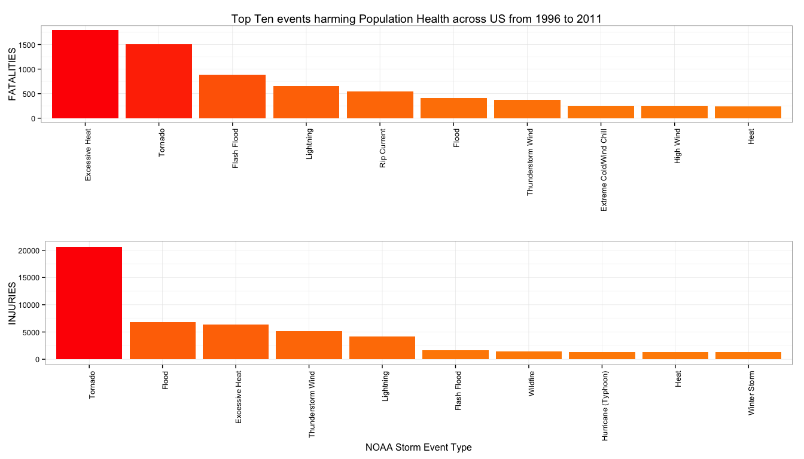
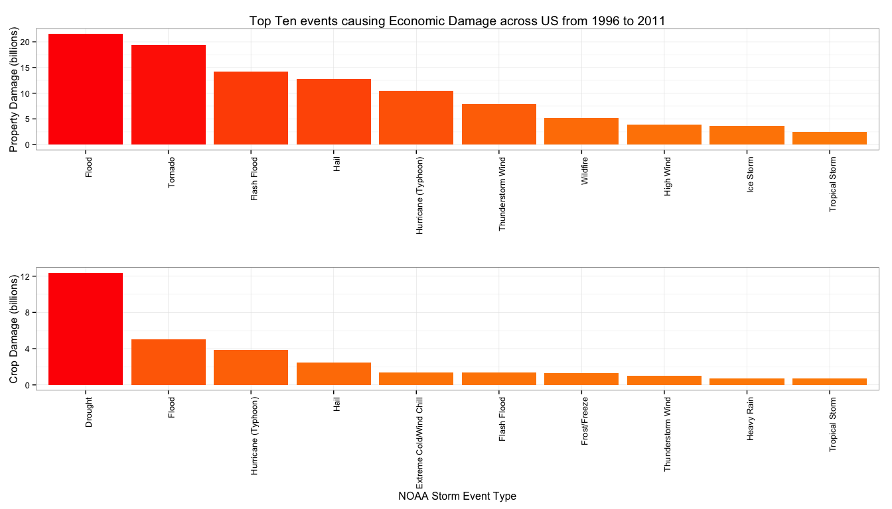

# Adverse Effects of NOAA Storm Events on Population and Economic Well-Being
Edwin Seah  
12 March 2015  


## Synopsis

This analysis is focused on determining the harmful effects of Storm Event Types `EVTYPE` on 
population health and economic consequences. For population health, the analysis will present the `EVTYPE` causing the top ten highest numbers of `FATALITIES` and `INJURIES`. However, since only some `EVTYPE` had such effects, we will ignore records that have zero `FATALITIES` or `INURIES`. For economic consequences, we perform a similar analysis and will omit observations causing zero property damages (`PROPDMG`) or crop damages (`CROPDMG`). 

The analysis is focused on data collected post-1995, since from the NOAA database 
48 storm event data types are reported since 1996 as per NWSI 10-1605 (dated 
AUGUST 17, 2007), whereas only tornado events were reported from 1950-1954, and only 
tornado, thunderstorm wind and hail events were reported from 1955-1992. Since the 
effects from these pre-1996 years will heavily skew the analysis and leave the 
majority of other event types unrepresented, the pre-1996 events are omitted.

Since the raw data has a large number of poorly recorded event types, these will all be transformed and classified into one of the 48 event types via a two-step classification process in order; firstly, through brute force direct substitution of misspelt events into their correct types, and secondly, through the use of the minimal cosine-similarity string distance measurement to bin the event types on a best-effort basis. 

Our final results will present the top ten population and economic effects per storm event type.

## Data Processing

> Getting and Loading the Data

The analysis requires 8 relevant columns (BGN_DATE, FATALITIES, INJURIES, PROPDMG, 
PROPDMGEXP, CROPDMG, CROPDMGEXP) to be selected (using `dplyr::select`) from the StormData file and read into a data frame **df**. We also load "sedtable.csv", a csv-file contaning the list of 48 NOAA Storm Event Data Types (from page 6 of NWSI 10-1605 dated Aug 17, 2007) into **sedtbl**.

```r
library(dplyr)
rawurl <- "https://d396qusza40orc.cloudfront.net/repdata%2Fdata%2FStormData.csv.bz2"
#download.file(url=rawurl, destfile="StormData.csv.bz2", method="curl")
# Loading Storm Data
df <- read.csv("StormData.csv.bz2", 
               na.strings=c("NA", "N/A", "", "<NA>"),
               stringsAsFactors=FALSE,
               ) %>% 
    select(BGN_DATE, EVTYPE, FATALITIES, INJURIES, PROPDMG, PROPDMGEXP, CROPDMG, CROPDMGEXP)
# Loading NOAA Storm Event Data Table of 48 standard types from repository
surl <- "https://github.com/slothdev/Reproducible-Research-PA2-Repo/blob/master/sedtable.csv"
#download.file(url=surl, destfile="sedtable.csv", method="curl")
sedtbl <- read.csv("sedtable.csv", sep=",", header=TRUE)
```

> Transforming and Subsetting the Data

`EVTYPE` will be transformed to match the title-cased NOAA Storm Event Data Types by applying
`stri_trans_totitle` from the **stringi** package to `EVTYPE`, creating `SEDTYPE`. `SEDTYPE` is used in place of `EVTYPE` for the rest of the analysis. We extract the year from `BGN_DATE` by using `year` from the **lubridate** package, creating `YYYY` so that we can subset only post-1995 data.

```r
# Transform EVTYPE into SEDTYPE
library(stringi)
df$SEDTYPE <- stri_trim_both(stri_trans_totitle(df$EVTYPE))
library(lubridate)
df$YYYY <- year(strptime(df$BGN_DATE, "%m/%d/%Y %H:%M:%S"))
df <- subset(df, YYYY>=1996)
```

> Pre-process to facilitate better cosine-similarity matching

After the pre-1996 data has been omitted, our subsetted **df** now contains data from 1996 till 2011. Two steps are taken to classify the event types on a best-effort basis. Our strategy involves firstly a brute-force synonym replacements of typos/related event names with one of the 48 event types, for every `SEDTYPE` that is classifiable. 

```r
# Place SEDTYPE into a temporary vector t
t <- df$SEDTYPE
# Preprocessing #1
# Brute-force synonym replacement
t <- gsub(" \\(G[0-9][0-9]\\)", "", t)
t <- gsub("Fld", "Flood", t)
t <- gsub("Flooding", "Flood", t)
t <- gsub("Tstm", "Thunderstorm", t)
t <- gsub("Wintry", "Winter Weather", t)
t <- gsub("Hyp[o,e,r]{1,}thermia.+", "Cold", t)
t <- gsub("[Ss]lide|Land[Ss]lump", "Debris Flow", t)
t <- gsub(".*Surf.*", "High Surf", t)
t <- gsub(".*Hurricane.*", "Hurricane", t)
t <- gsub(".*Warm.*", "Heat", t)
t <- gsub("Wild.+ ", "Wild", t)
t <- gsub("Brush Fire", "Wildfire", t)
# Specific Classifiable Type replacements
t <- gsub("Cold And Snow|Cold (Temperature|Weather)", "Cold", t)
t <- gsub("(Extended|Un[r,s]easonabl[e,y]) Cold", "Extreme Cold", t)
t <- gsub("Black Ice|Ice On Road|Ic[e,y]{1,} Roads|Damaging Freeze", "Frost/Freeze", t)
t <- gsub("Snow Squall|Excessive Snow|Blowing Snow", "Heavy Snow", t)
t <- gsub("Light Snow|Snow And Ice|Falling Snow\\/Ice|Mixed Precip|Rain\\/Snow",
                     "Sleet", 
                     t)
t <- gsub("Record Heat", "Excessive Heat", t)
t <- gsub("Rough Seas|High Swells|High Seas", "Marine High Wind", t)
t <- gsub("Heavy Seas", "Marine Strong Wind", t)
t <- gsub("Non.Thunderstorm Wind|Gusty Wind|Non-Severe Wind Damage", "Wind", t)
t <- gsub("(Dry|Wet) Microburst|Downburst|Microburst", "Strong Wind", t)
t <- gsub("Gradient Wind|Whirlwind", "Strong Wind", t)
t <- gsub("River Flood|Ice Jam Flood", "Flood", t)
t <- gsub("Dam Break", "Flash Flood", t)
t <- gsub("Tidal Flood|Beach Erosion", "Coastal Flood", t)
t <- gsub("Freezing Spray", "Freezing Fog", t)
t <- gsub("Freezing (Drizzle|Rain){1}|Glaze", "Ice Storm", t)
t <- gsub("High Water", "Storm Surge/Tide", t)
t <- gsub("Urban/Sml Stream ", "Storm Surge ", t)
t <- gsub("Torrential Rainfall", "Heavy Rain", t)
t <- gsub("Rogue Wave", "Seiche", t)
# Unclassifiables replaced with "Other"
t <- gsub("Drowning|Marine Accident", "Other", t)
# Place cleaned event types back into data frame
df$SEDTYPE <- t
```
Secondly, we use the cosine-similarity measure from the **stringdist** package via mutating `SEDTYPE` through **ddply**, replacing with whichever of the 48 types possesses the shortest cosine-similarity distance to itself. For instance, a distance of 1 is a perfect match (eg. "Avalanche" to "Avalanche"), while the minimum distance of any of the 48 types is 0.2354471 between "Tstm Wind" and "Thunderstorm Wind".

```r
# Preprocessing Step 2 - Cosine-similarity replacement
library(plyr)
library(stringdist)
df <- ddply(df, .(SEDTYPE), mutate, SEDTYPE=sedtbl$EVENT[which.min(stringdist(SEDTYPE, sedtbl$EVENT, method="cosine"))])
```

> Details of Analysis on Population Health and Economic Consequences effects from Storm Event Types

Our analysis could have been performed prior to the prior pre-processing step using smaller data frames subsetted for FATALITIES/INJURIES and PROPDMG/CROPDMG. However, since we needed to group by the event type anyway, the summarisation is done here, after the events types are standardized. We subset **ph** and **ec** as the data frames for population health and economic consequences respectively, leaving out any observations from **df** that had zero effects (i.e. FATALITIES, INJURIES, PROPDMG or CROPDMG are zero). To normalise the economic damage figures, `PROPDMG` and `CROPDMG` are multipled by their specified exponent (PROPDMGEXP or CROPDMGEXP, where "K", "M" and "B" stand for 10^3, 10^6 and 10^9 respectively).


```r
# Subset observations for population health and economic impact into two data frames ph and ec respectively
library(dplyr)
ph <- subset(df, FATALITIES>0 | INJURIES>0) %>%
    select(SEDTYPE, FATALITIES, INJURIES)
ec <- subset(df, PROPDMG>0 | CROPDMG>0) %>% 
    select(SEDTYPE, PROPDMG, PROPDMGEXP, CROPDMG, CROPDMGEXP) %>% 
    mutate(PROPDMG = PROPDMG * (ifelse
                                (PROPDMGEXP=="K",
                                 10^3,
                                 ifelse(PROPDMGEXP=="M",
                                        10^6,
                                        ifelse(PROPDMGEXP=="K",
                                               10^9,
                                               10^0)))),
           CROPDMG = CROPDMG * (ifelse
                                (CROPDMGEXP=="K",
                                 10^3,
                                 ifelse(CROPDMGEXP=="M",
                                        10^6,
                                        ifelse(CROPDMGEXP=="K",
                                               10^9,
                                               10^0))))) %>%
    select(SEDTYPE, PROPDMG, CROPDMG)
```

For population health effects, we summarise the total FATALITIES and INJURIES per `SEDTYPE` from **ph** (12764 recorded observations), and generate a top-ten list for both FATALITIES and INJURIES, which we store in the data frames **f10** and **i10**.


```r
ph <- ph %>% 
    group_by(SEDTYPE) %>% 
    summarise_each(funs(sum), FATALITIES, INJURIES)
# Get Top Ten events for FATALITIES and INJURIES
f10 <- ph %>% arrange(desc(FATALITIES)) %>% head(10)
i10 <- ph %>% arrange(desc(INJURIES)) %>% head(10)
```

For economic consequences, we summarise the total PROPDMG and CROPDMG per `SEDTYPE` from **ec** (194525 recorded observations), and generate a top-ten list for both PROPDMG and CROPDMG, which we store in the data frames **pd10** and **cd10**.


```r
ec <- ec %>%
    group_by(SEDTYPE) %>%
    summarise_each(funs(sum(., na.rm=TRUE)), PROPDMG, CROPDMG) %>%
    mutate(PROPDMG=PROPDMG/10^9, CROPDMG=CROPDMG/10^9)
# Get Top Ten events for PROPDMG and CROPDMG
pd10 <- ec %>% arrange(desc(PROPDMG)) %>% head(10)
cd10 <- ec %>% arrange(desc(CROPDMG)) %>% head(10)
```

## Results

> Fig.1 Harmful Effects to Population Health

The top ten events that cause the highest number of fatalities and injuries are plotted in the figure below. While **Excessive Heat** causes the most fatalities (**1799**), **Tornado** causes a far larger number of injuries (**20667**). The top-ten events cumulatively account for **6672** or **76.41%** of all Fatalities (**8732**) and **49604** or **85.56%** of all Injuries (**57975**) for the period from 1996 to 2011.

```r
library(ggplot2)
library(gridExtra)
# Reorder factor levels from top to bottom
f10$SEDTYPE <- factor(f10$SEDTYPE, levels = f10$SEDTYPE[order(desc(f10$FATALITIES))])
i10$SEDTYPE <- factor(i10$SEDTYPE, levels = i10$SEDTYPE[order(desc(i10$INJURIES))])
# Plot FATALITIES f10 as p1, INJURIES i10 as p2
p1 <- ggplot(data=f10, aes(x=SEDTYPE, y=FATALITIES, fill=FATALITIES)) + 
    geom_bar(stat="identity") + 
    scale_fill_gradient(low="dark orange", high="red") + 
    theme_bw() + theme(axis.text.x=element_text(angle=90, hjust=1), legend.position="none") + 
    xlab("") +
    ggtitle("Top Ten events harming Population Health across US from 1996 to 2011")
p2 <- ggplot(data=i10, aes(x=SEDTYPE, y=INJURIES, fill=INJURIES)) + 
    geom_bar(stat="identity") + 
    scale_fill_gradient(low="dark orange", high="red") + 
    theme_bw() + theme(axis.text.x=element_text(angle=90, hjust=1), legend.position="none") + 
    xlab("NOAA Storm Event Type")
grid.arrange(p1, p2)
```

 

> Fig. 2 Economic Consequences

Property is adversely affected the most by **Flood** (**$21.57 billion**) while **Drought** causes the most damage (**$12.37 billion**) for Crops. The top-ten events cumulatively represent **$99.5 billion** or **90.93%** of all Property Damage (**$109.42 billion**) and **$29.85 billion** or **92.57%** of all Crop Damage (**$32.24 billion**) for the period from 1996 to 2011.

```r
# Get Top Ten events causing PROPDMG and CROPDMG
pd10 <- ec %>% arrange(desc(PROPDMG)) %>% head(10)
cd10 <- ec %>% arrange(desc(CROPDMG)) %>% head(10)
# Plot damages
pd10$SEDTYPE <- factor(pd10$SEDTYPE, levels = pd10$SEDTYPE[order(desc(pd10$PROPDMG))])
cd10$SEDTYPE <- factor(cd10$SEDTYPE, levels = cd10$SEDTYPE[order(desc(cd10$CROPDMG))])
p1 <- ggplot(data=pd10, aes(x=SEDTYPE, y=PROPDMG, fill=PROPDMG)) + 
    geom_bar(stat="identity") + 
    scale_fill_gradient(low="dark orange", high="red") + 
    theme_bw() + 
    theme(axis.text.x=element_text(angle=90, hjust=1), legend.position="none") + 
    xlab("") + 
    ylab("Property Damage (billions)") +
    ggtitle("Top Ten events causing Economic Damage across US from 1996 to 2011")
p2 <- ggplot(data=cd10, aes(x=SEDTYPE, y=CROPDMG, fill=CROPDMG)) + 
    geom_bar(stat="identity") + 
    scale_fill_gradient(low="dark orange", high="red") + 
    theme_bw() + theme(axis.text.x=element_text(angle=90, hjust=1), legend.position="none") + 
    xlab("NOAA Storm Event Type") + 
    ylab("Crop Damage (billions)")
grid.arrange(p1, p2)
```

 

## References
+ Raw [Storm Data](https://d396qusza40orc.cloudfront.net/repdata%2Fdata%2FStormData.csv.bz2) [47Mb]
+ National Weather Service [Storm Data Documentation](https://d396qusza40orc.cloudfront.net/repdata%2Fpeer2_doc%2Fpd01016005curr.pdf)
+ National Climatic Data Center Storm Events [FAQ](https://d396qusza40orc.cloudfront.net/repdata%2Fpeer2_doc%2FNCDC%20Storm%20Events-FAQ%20Page.pdf)
+ From NWSI 10-1605 (dated Aug 17, 2007), the NOAA database contains 48 event types (1950-1954 only tornado, 1955-1992 tornado, thunderstorm wind and hail, and 1996-present all 48), as retrieved from [Storm Events Database](http://www.ncdc.noaa.gov/stormevents/details.jsp)
+ [Table of 48 Event Types](https://github.com/slothdev/Reproducible-Research-PA2-Repo/blob/master/sedtable.csv) produced from NWSI 10-1605 (dated Aug 17, 2007) page 6
